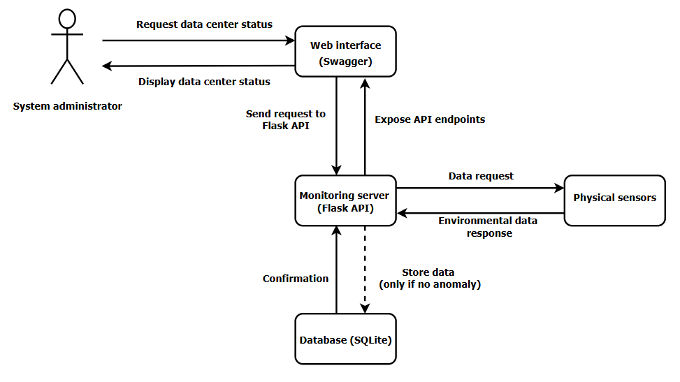

# DataCenter Monitor

**DataCenter Monitor** is a Flask API that monitors the environmental status of servers in a data center.  
It detects anomalies using an **rule-based thresholds**, stores data in an **SQLite** database, and provides interactive documentation via **Swagger UI**.

---

## Features

- **Complete REST API** with Flask  
- **Anomaly detection** via  rule-based thresholds  
- Integrated **SQLite database**  
- **Data integrity** verified by SHA-256 fingerprint  
- **Swagger UI** for easy endpoint testing  
- **Monitoring multiple environmental factors**: temperature, humidity, airflow, smoke, water leak, power status  
- **Simplified deployment with Docker**

---

## General Diagram System



---

## Report
[See the report](../docs/report.md)

---

## Deployment with Docker
### Installation

#### 1️⃣ Clone the repository
```bash
git clone https://github.com/Bodichane/DataCenterMonitor.git
cd DataCenterMonitor
```
#### 2️⃣ Build the Docker image
```bash
docker build -t datacentermonitor .
docker run -p 8080:8080 datacentermonitor
```

## Usage

In the browser address bar, enter http://localhost:8080/apidocs.

Using the Swagger UI graphical interface, start the monitoring process by selecting the REST API /datacenter/monitor method and entering the following test parameters:

1️⃣ Monitor Environmental Data (POST /datacenter/monitor)

Send environmental parameters for a given server. Example test prompts:

Normal data:
```
{
  "server_id": 1,
  "temperature": 45,
  "humidity": 50,
  "airflow": 3,
  "smoke_detected": false,
  "water_leak": false,
  "power_status": "OK"
}
```

Trigger temperature anomaly:
```
{
  "server_id": 1,
  "temperature": 60,
  "humidity": 50,
  "airflow": 3,
  "smoke_detected": false,
  "water_leak": false,
  "power_status": "OK"
}
```

Expected response:

`{"error": "Anomaly detected!"}`


Trigger smoke or water anomaly:
```
{
  "server_id": 1,
  "temperature": 40,
  "humidity": 45,
  "airflow": 3,
  "smoke_detected": true,
  "water_leak": false,
  "power_status": "OK"
}
```

Trigger power failure:
```
{
  "server_id": 1,
  "temperature": 40,
  "humidity": 45,
  "airflow": 3,
  "smoke_detected": false,
  "water_leak": false,
  "power_status": "FAIL"
}
```
2️⃣ Retrieve Recent Measurements (GET /datacenter/history)

Returns the last 10 environmental measurements including all factors.

Example response:
```
[
  {
    "id": "abc123",
    "server_id": 1,
    "temperature": 45,
    "humidity": 50,
    "airflow": 3,
    "smoke_detected": false,
    "water_leak": false,
    "power_status": "OK",
    "timestamp": 1699999999,
    "date": "2025-10-09 12:34:56"
  }
]
```

3️⃣ Check Overall System Status (GET /datacenter/status)

Returns general system health:
```
{
  "status": "Operational",
  "last_backup": 1699999999
}
```
### Notes

Use Swagger UI to easily test all endpoints without writing custom scripts.

The system simulates measurements if some parameters are not provided.

Docker ensures a consistent environment for anyone cloning the repository.
