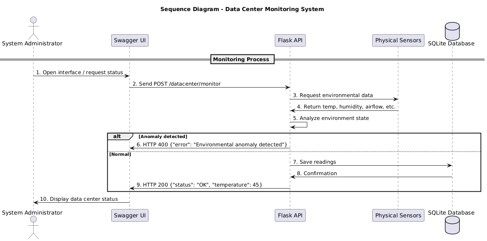
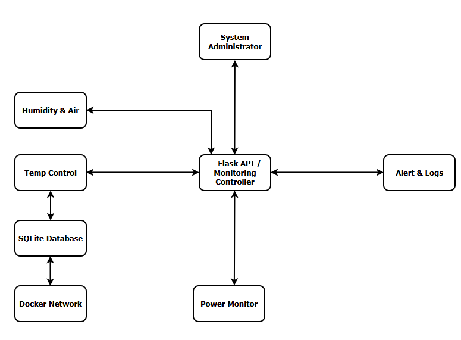
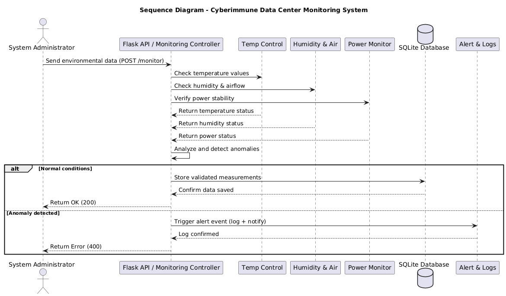

## Cyberimmune Data Center Environmental Monitoring System

---

## Table of Contents
- [1. Problem Statement](#1-problem-statement)
- [2. Values, Damages, and Unacceptable Events](#2-values-damages-and-unacceptable-events)
- [3. Known Constraints and Initial Conditions](#3-known-constraints-and-initial-conditions)
- [4. Security Goals and Assumptions (SGA)](#4-security-goals-and-assumptions-sga)
- [5. System Architecture](#5-system-architecture)
- [6. Basic System Operation Scenario](#6-basic-system-operation-scenario)
- [7. Data Center Module Architecture](#7-data-center-module-architecture)
- [8. Negative Scenarios (Failure or Attack Cases)](#8-negative-scenarios-failure-or-attack-cases)
- [9. Architectural Decomposition](#9-architectural-decomposition)
- [10. Base Scenario for Decomposed Architecture](#10-base-scenario-for-decomposed-architecture)
- [11. Architecture Policy](#11-architecture-policy)
- [12. Quality Evaluation by Domain](#12-quality-evaluation-by-domain)
- [13. Trust Level Justification](#13-trust-level-justification)
- [14. Negative Scenario Validation](#14-negative-scenario-validation)

---

## 1. Problem Statement

The company is developing a **cyberimmune data center monitoring system** designed to ensure safe and stable operation of servers by automatically controlling the **environmental parameters** (temperature, humidity, airflow, smoke, water leakage, and power status).

The system must detect abnormal environmental conditions that may threaten equipment integrity or cause downtime. It should also guarantee **data integrity**, ensure **continuous availability**, and prevent potential **cyberattacks** aimed at disrupting operations or falsifying measurements.

---

## 2. Values, Damages, and Unacceptable Events

| Value | Negative Event | Impact Level | Comment |
|--------|----------------|---------------|-----------|
| Personnel | Overheating or smoke leads to fire hazard | High | May cause injuries, legal liability |
| Equipment | Temperature or humidity anomaly damages servers | High | Loss of assets and downtime |
| Data Integrity | Loss or alteration of monitoring data | Medium | Leads to poor maintenance decisions |
| Infrastructure | Flood or power anomaly causes system outage | High | Risk of destruction or financial losses |
| Confidential Information | Unauthorized access to system or logs | High | Cybersecurity breach and trust loss |

---

## 3. Known Constraints and Initial Conditions

- The system is implemented as a **microservice architecture** based on **Flask (Python)**.
- Communication with users occurs through a **REST API**, documented using **Swagger UI**.
- Data persistence is handled by an **SQLite** database.
- The system uses **threshold-based anomaly detection** and can be extended with **machine learning** (Isolation Forest).
- Deployment is done using **Docker** for portability.

---

## 4. Security Goals and Assumptions (SGA)

### Security Goals
- Only authenticated requests are processed.
- Environmental anomalies are detected and logged automatically.
- The system maintains integrity and availability even in case of partial failure.
- Sensitive data (sensor readings, hashes) remain unaltered and traceable.

### Security Assumptions
- Only authorized administrators access the monitoring API.
- The physical sensors are considered trusted and correctly calibrated.
- The SQLite database is stored in a protected environment.
- The Docker environment is secured from external tampering.
- Network communications occur in a controlled LAN or VPN.

---

## 5. System Architecture

**Actors:**
- **System Administrator** – interacts via Swagger UI to monitor and control the data center environment.
- **Monitoring Controller (Flask API)** – central unit processing all data and coordinating modules.
- **Physical Sensors** – measure temperature, humidity, airflow, and smoke.
- **Power & Safety Module** – monitors power and emergency signals.
- **Alert Manager** – sends alerts in case of anomaly detection.
- **SQLite Database** – stores validated sensor readings and logs.

### General Diagram System

### Sequence Diagram System

### Data Center Architecture

### Basic scenario for data center operation

---

## 6. Basic System Operation Scenario

1. The administrator accesses **Swagger UI**.
2. They call the endpoint **`/datacenter/monitor`** with environmental data.
3. The **Flask API** validates the input and checks for anomalies.
4. If conditions are normal, the data is **stored in the SQLite database**.
5. If an anomaly is detected, the API returns a **400 error** and **does not store** the data.
6. The administrator can query **`/datacenter/history`** or **`/datacenter/status`** for reports.

---

## 7. Data Center Module Architecture

| **Component** | **Description** |
|----------------|-----------------|
| **Monitoring Controller (Flask API)** | Central logic handling data requests, anomaly detection, and alert triggering. |
| **Sensor Interface** | Connects to environmental sensors (temperature, humidity, airflow, smoke). |
| **Power & Safety Module** | Monitors electrical status and detects emergency conditions (fire, outage). |
| **Database Layer (SQLite)** | Stores validated measurements and historical logs. |
| **Integrity Module** | Validates the consistency of stored data using SHA-256 hashing. |
| **Alert Manager** | Sends alerts to the administrator when anomalies are detected. |
| **Swagger UI** | User interface for monitoring and API interaction. |

---

## 8. Negative Scenarios (Failure or Attack Cases)

Below are identified negative scenarios that may affect the cyberimmune data center system. Each scenario is linked to a risk mitigation strategy.

| **ID** | **Description** | **Impact** | **Mitigation Strategy** |
|--------|------------------|-------------|--------------------------|
| NS-1 | Temperature sensor reports incorrect data (false overheating) | Medium | Cross-validate readings with humidity and airflow sensors before alerting |
| NS-2 | Database integrity compromised (corrupted or tampered data) | High | Apply SHA-256 integrity verification before each data query or insertion |
| NS-3 | Unauthorized access to the API | High | Enforce authentication (API key / token) and IP restrictions |
| NS-4 | Network or Docker container failure | Medium | Use container orchestration with automatic restart and persistent volumes |
| NS-5 | Power outage causes service interruption | Medium | Implement UPS monitoring and auto-recovery procedure after reboot |
| NS-6 | Communication failure with sensor module | High | Retry requests with exponential backoff and log all failures |
| NS-7 | Alert module fails to send notifications | Medium | Store alerts locally and retry sending upon network restoration |

---

## 9. Architectural Decomposition

The architecture is decomposed into modular components, each responsible for a specific functionality. This separation allows for fault isolation, simplified maintenance, and better security management.

| **Module** | **Responsibilities** |
|-------------|----------------------|
| **Monitoring Controller (Flask API)** | Central node managing data acquisition, anomaly detection, and system coordination. |
| **Temperature & Humidity Sensor Layer** | Collects physical environment data and transmits it to the controller. |
| **Power & Safety Module** | Monitors power input, detects anomalies, and triggers safety shutdowns. |
| **Database Manager (SQLite)** | Handles data storage, querying, and backup operations. |
| **Integrity Verifier** | Validates data consistency through SHA-256 hash comparison before storing or serving records. |
| **Alert Manager** | Sends alerts to the administrator (email/logs) upon anomaly detection. |
| **Docker Environment** | Provides isolation, portability, and recovery mechanisms for each service. |

---

## 10. Base Scenario for Decomposed Architecture

1. Administrator triggers monitoring via Swagger UI.
2. Flask API (Monitoring Controller) requests readings from sensors and power module.
3. Data is sent to the Integrity Checker for validation.
4. If integrity passes and values are within limits, data is stored in the database.
5. If an anomaly is detected (e.g., overheating, power fault), the Alert Manager sends a notification and data is not stored.
6. Administrator can view logs and alerts from Swagger UI.

---

## 11. Architecture Policy

- Data must be verified before insertion.
- System must handle abnormal inputs gracefully.
- Only trusted Docker images are deployed.
- Logs and history are retained for auditing.
- No data is stored if anomaly is detected.

---

## 12. Quality Evaluation by Domain

| Domain | Quality Attribute | Level |
|---------|-------------------|--------|
| Reliability | Continuous monitoring and fault tolerance | High |
| Integrity | SHA-256 checksum verification | High |
| Availability | Dockerized and restartable service | High |
| Maintainability | Modular Python code (Flask + SQLite) | High |
| Usability | Swagger UI interface | Medium |

---

## 13. Trust Level Justification

- **SQLite Database** – trusted local storage, minimal attack surface.
- **Flask API** – verified Python runtime, open-source dependencies.
- **Docker Container** – ensures isolation and reproducibility.
- **Sensors** – assumed trusted, may require calibration.

---

## 14. Negative Scenario Validation

### NSV-1: Temperature Anomaly Simulation
- Input: `{"temperature": 60}`
- Output: HTTP 400 – `{"error": "Environmental anomaly detected!"}`
- Validation: System reacts correctly.

### NSV-2: Normal Environment
- Input: `{"temperature": 45, "humidity": 50, "airflow": 3}`
- Output: HTTP 200 – normal state stored in database.
- Validation: Data is recorded only if valid.

---

**Conclusion:**  
The Data Center Monitoring System successfully implements environmental anomaly detection, data integrity verification, and secure data recording using a Flask-based architecture. The system is modular, secure, and extensible for future cyberimmunity features.

